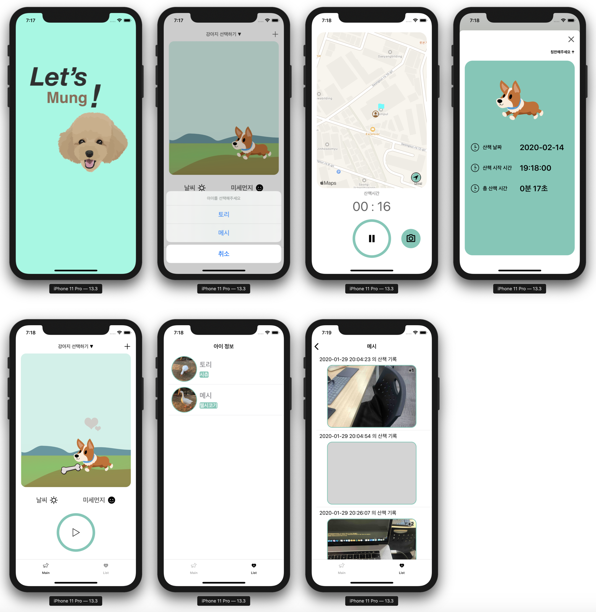

# Pet Walk

> 패스트캠퍼스 iOS School에서 진행했던 자체 해커톤 프로젝트입니다.

## Description

> 강아지를 키우는 사람들에게 강아지와 산책하는 것에 동기를 부여하기 위한 앱
>
> 산책을 통해 강아지 뿐만 아니라강아지를 키우는 사람도 재미를 느낄 수 있도록 목표 장소로 산책을 다녀오면 reward를 제공하는 컨셉으로 개발

- 기간 : 2020.01.17
- 사용 기술
  - Language : Swift
  - Framework : UIKit, CoreLocation, MapKit
  - Service : Firestore, Firebase Storage
- 팀원 : 3명
- 맡은 역할
  - 산책 데이터 구조 설계
  - Firebase와 연동하여 산책 데이터를 저장하고 화면에 나타내는 로직 개발
  - 사용자가 설정된 목표 지점의 일정 범위(50m) 안으로 들어왔다는 것을 판단하는 로직 개발
- 성과
  - 자체 평가 2위
  - 이미지를 caching해서 사용함으로써 저장한 이미지를 화면에 나타낼 때 URL을 통해 요청하는 시간에 의해 delay가 발생하고 화면에 진입할 때 마다 사용자가 빈 화면을 봐야 하는 문제를 해결
- 배운 점
  - Firestore를 사용한 데이터 저장 및 서버로부터 데이터를 요청할 때 비동기 작업 처리 경험
  - CoreLocation과 MapKit을 통한 위치 기반 서비스 사용 경험
- 아쉬운 점
  - 초기 기획이 미흡한 상태로 시작하여 개발할 수록 어떻게 개발해야 할지 방향을 잡지 못함. 어떤 기능을 어떤 형태로 개발할 것인지 명확하게 정의되어 있어야 함을 느낌.
  - MVC Pattern을 적용하려고 시도했지만, app 크기가 커지면서 여러 개의 MVC 모듈을 적절하게 결합하지 못하고 각 part에 맞게 비지니스 로직을 분리하지 못함. 이것은 결국 유지보수성을 크게 떨어뜨려 심각한 버그가 발생했을 때 빠르게 대처하지 못한 원인이 됨

## Implementation

- 전체 실행 화면

<p align="center">
	
</p>
- 산책 데이터의 구조

  ```json
  {
    "Pets": [
      {
        "name": "mesh",
        "breed": "welshcorgi",
        "birth": "2020-01-01",
        "gender": "M",
        "profileURL": "{imageURL}",
        "weight": 10,	// kg
        "walks": [
          {
            "date": "",
            "duration": 3209,	// sec
            "weather": "",
            "dust": "",
            "images": [
              "{imageURL}",
              "{imageURL}",
            ]
          },
        ]
      },
    ]
  }
  ```

## Trouble Shooting

- Database에 데이터를 저장하는 동안 예상치 못한 사용자 입력 때문에 메인 화면에서 잘못된 데이터를 받아오는 문제

  - Database와 통신하는 시간이 길어지면서 데이터를 저장하고 불러오는 작업이 끝나기 전에 사용자가 의도하지 않은 동작을 할 가능성이 있음. 의도하지 않은 사용자 입력을 막고 서버와 통신하고 있다는 것을 인식시키기 위해 별도의 로딩 화면(`LoadingViewController`)을 만들어서 해결

  - Database 관련 작업의 성공/실패 여부에 따라 다음에 수행할 추가 작업을 위한 `LoadingViewControllerInterface` 구현

    ```swift
    protocol LoadingViewControllerInterface {
      // Database 작업에 성공했을 때, 추가작업을 completion으로 처리
      func complete(completion: @escaping ()->())
      // Database 작업에 실패했을 때, 사용자 알림(alert)을 위한 message 전달
      func fail(message: String)
    }
    ```

- 산책한 기록을 볼 수 있는 화면에서 사용자가 비어있는 화면을 오랫동안 보고 있어야 하는 문제

  - Firebase storage에 저장된 이미지를 받아오는 요청에 대한 Firebase 서버의 응답시간이 지연되어 발생하는 문제

  - 산책 기록 화면이 처음 나타날 때 firebase에 이미지를 요청해서 받아온 결과를 Singleton 객체를 통해 별도로 **캐싱(caching)**해 두고, 이후 산책 화면이 나타날 때는 Firebase 서버에 이미지를 요청하지 않고 캐싱해 둔 이미지를 사용하도록 함

  - 최초로 이미지를 요청하거나 새로운 이미지가 update 되었을 때만 firebase 서버와 통신하도록 함

    ```swift
    // MARK: Data Caching
    
    // caching when register new pet
    var currentPets = [Pet]()             
    // caching when walk list appear at first or new walk info updated
    var walksForPet = [String: [Walk]]()  
    
    // MARK: Image Caching
    
    // caching when pet list appear at first
    var petProfileCache = [String: UIImage]()
    // caching when walk list appear at first or new alk info updated
    var walkImageCache = [String: [UIImage]]()
    ```
